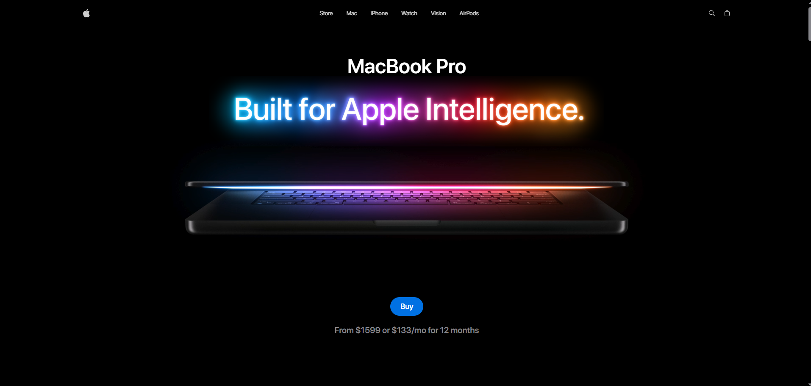

# 🚀 Apple Mabook Website

A modern, interactive web application showcasing **MacBook models**, features, and performance highlights. Built with **React**, **TailwindCSS**, and **Three.js**, this app delivers a visually rich, responsive, and immersive experience.

---

  

---

## 🎨 Demo
Check out the live demo (if hosted) or view screenshots below to experience the app’s interactive hero section, 3D MacBook models, and feature showcases.

---

## ✨ Features
- **🎬 Interactive Hero Section**: Full-screen video with call-to-action button.  
- **💻 3D MacBook Models**: Users can view and interact with MacBook 14, 16, and other variants.  
- **⚡ Performance Showcase**: Highlights key features, battery life, and benchmarks using images and videos.  
- **🎯 Feature Highlights**: Scrollable sections with icons and videos to explain product capabilities.  
- **📱 Responsive Design**: Optimized for laptops, desktops, and large monitors.  
- **🎨 Smooth Animations**: Hover effects, smooth transitions, and scroll effects for a premium experience.

---

## 🛠️ Technologies Used
- **React** – Component-based UI development.  
- **TailwindCSS** – Rapid utility-first styling.  
- **Three.js & @react-three/fiber** – Interactive 3D model rendering.  
- **Vite** – Fast development server and bundler.  
- **JavaScript (ES6+)** – Core functionality and interactivity.

---

Made with ❤️ using React, TailwindCSS, and Three.js